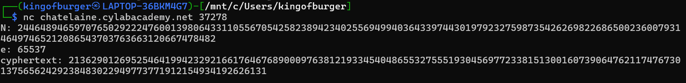

# **# EVEN RSA CAN BE BROKEN???**

\----------------------------------------------------------------------------------------------------------------------------------------

## **#APPROACH**

First thing I did was run the netcat connection in kali, and it gave me some pretty weird values, such as N,e,and cyphertext (ciphertext with funny spelling). I knew that these values are used in solving RSA encryption. All that I had to do was learn how to code the solution, and use the values I already have.

The first thing of order was finding p and q which are prime factors of N. This was a very weird task, and took me a solid 4-5 minutes, because I just didn't know where to begin. But then i noticed, that N ends in 2, and we know that any number ending in 2, can be divided by 2, and we also know 2 is prime. So, p=2, and q=N/2. all that was left was just decoding, and I got the flag pretty easily.

\----------------------------------------------------------------------------------------------------------------------------------------

## **#SOLUTION**

This service provides you an encrypted flag. Can you decrypt it with just N \& e? Connect to the program with netcat:

**$ nc chatelaine.cylabacademy.net 37278**

and the encryption code in python. From the chall title itself, its very clear that the **encryption is RSA**.

running the netcat connection gives us values of n,e, and ciphertext.

**N: 24464894659707650292224760013980643311055670542582389423402556949940364339744301979232759873542626982268650023600793146497465212086543703763663120667478482**

**e: 65537**

**cyphertext: 21362901269525464199423292166176467689000976381219334540486553275551930456977233815130016073906476211747673013756562429238483022949773771912154934192626131**

Now, our first step of order should be to find p, and q.

p=2

q=n//2

with p and q found, we can easily make a decoder.

#### **SOLVE.PY:**

from Crypto.Util.number import long\_to\_bytes

n = 24464894659707650292224760013980643311055670542582389423402556949940364339744301979232759873542626982268650023600793146497465212086543703763663120667478482

e = 65537

c = 21362901269525464199423292166176467689000976381219334540486553275551930456977233815130016073906476211747673013756562429238483022949773771912154934192626131

p = 2

q = n // 2

phi = (p - 1) \* (q - 1)

d = pow(e, -1, phi)

m = pow(c, d, n)

print(long\_to\_bytes(m))

and we get our flag.

\----------------------------------------------------------------------------------------------------------------------------------------

## **#FLAG**

**academy{tw0\_1$\_pr!m3cfb893a9}**

\----------------------------------------------------------------------------------------------------------------------------------------

## **#TAKEAWAY**

**If RSA 'N' has 2 in units digit, p=2, and q=n//2.**

