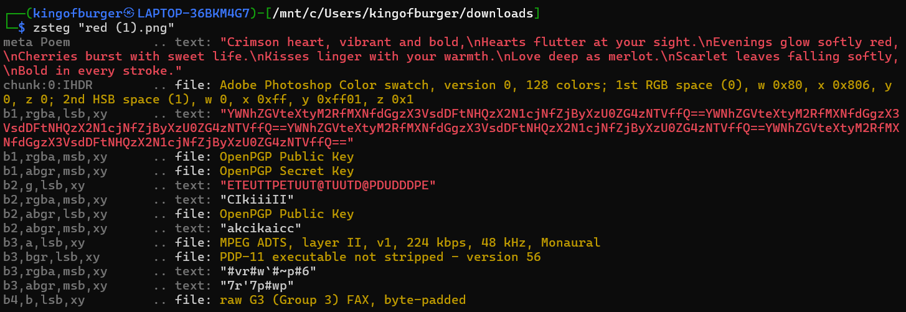

# **#RED**

## **#APPROACH**

All we have in this chall is an image named red.png. Being the Forensics god that I am (joking please don't flame me), first thing I know to do is check the basic tools, such as exiftool, zsteg, binwalk. All of these tools help in getting metadata info or find hidden files. Exiftool produced nothing, so next i checked zsteg which gave a pretty long text of sorts... in RED color. Aha! The text was actually a cipher, and with simple decoding using dcode.fr's inbuilt decipherer, the flag was found easily.

## **#SOLUTION**

Download the image (in my case it is named red (1).png as this is not my first time attempting this chall). 
.png)

Run zsteg on the image to get hidden text.

"YWNhZGVteXtyM2RfMXNfdGgzX3VsdDFtNHQzX2N1cjNfZjByXzU0ZG4zNTVffQ==YWNhZGVteXtyM2RfMXNfdGgzX3VsdDFtNHQzX2N1cjNfZjByXzU0ZG4zNTVffQ==YWNhZGVteXtyM2RfMXNfdGgzX3VsdDFtNHQzX2N1cjNfZjByXzU0ZG4zNTVffQ==YWNhZGVteXtyM2RfMXNfdGgzX3VsdDFtNHQzX2N1cjNfZjByXzU0ZG4zNTVffQ=="

This is base64 cipher. Simple decoding produces us the flag.

## **#FLAG**

**academy{r3d\_1s\_th3\_ult1m4t3\_cur3\_f0r\_54dn35}**

## **#TAKEAWAY**

Images usually contain useful info in zsteg.

