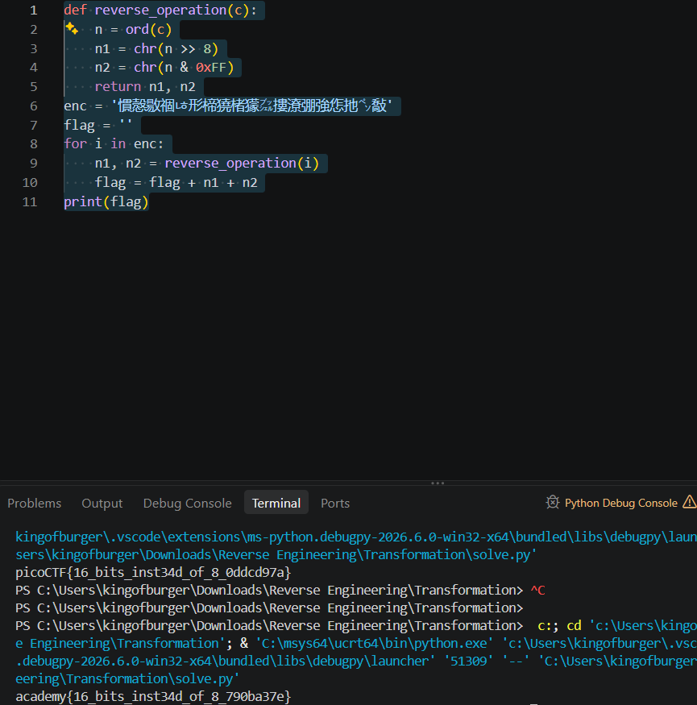

# **#Transformation**

## **#Approach**

A chal description with a line of code and some Chinese yap I don't understand. First thing I did was run exiftool and zsteg on the enc file just in case (it led to nothing). Then, i focused on the chall description. The line of code was basically telling us that two bytes of the encrypted flag (i and i+1) are being combined into a single integer, with flag\[i] being first shifted 8 bytes left. So, to reverse this, we will combine two characters where the \[i] component will be shifted 8 bytes right instead, basically reversing the process.

## **#Solution**

They encrypted file contained the text, 慣慤敭祻ㄶ形楴獟楮獴㌴摟潦弸強㤰扡㌷敽

We are also given the encryption itself,

**''.join(\[chr((ord(flag\[i]) << 8) + ord(flag\[i + 1])) for i in range(0, len(flag), 2)])**

To reverse this, we will just run AND (combine) flag\[i]>>8 and the next part (0xff).

def reverse\_operation(c):

&#x20;   n = ord(c)

&#x20;   n1 = chr(n >> 8)

&#x20;   n2 = chr(n \& 0xFF)

&#x20;   return n1, n2

enc = '慣慤敭祻ㄶ形楴獟楮獴㌴摟潦弸強㤰扡㌷敽'

flag = ''

for i in enc:

&#x20;   n1, n2 = reverse\_operation(i)

&#x20;   flag = flag + n1 + n2

print(flag)

Running which, would give us our flag.

## **#FLAG**

**academy{16\_bits\_inst34d\_of\_8\_790ba37e}**

## **#TAKEAWAY**

bitwise shifting is easy to decipher, most of the time, try to do the exact opposite of what the encryption is doing, which in this case was shifting right instead of shifting left.

